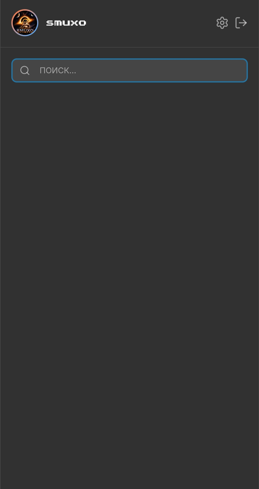
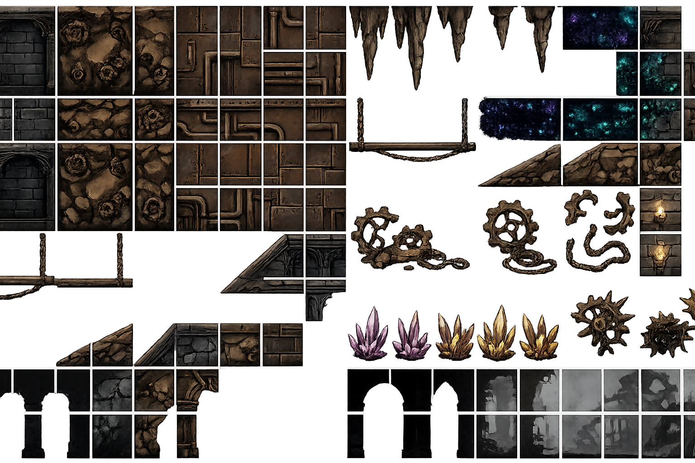
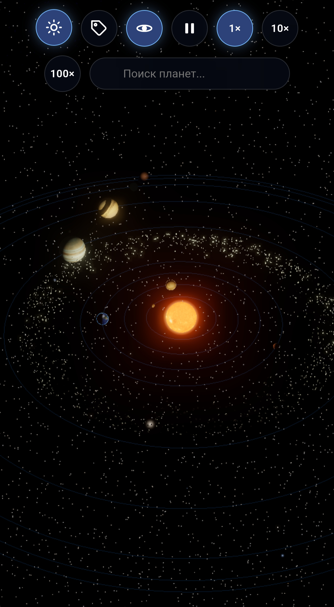
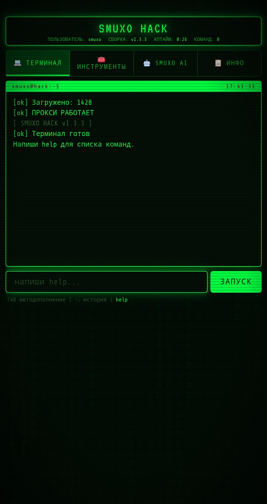

<div align="center">


# Дароу

### Космос • Хак • Игры • FLICK • Ленивость


</div>

---

# ⚡ whoami

```javascript
const smuxo = {
  greeting: "Дароу",

  currentlyBuilding: [
    "FLICK",
    "smuxo-knight",
    "Kosmos",
    "smuxo-Hack"
  ],

  interests: [
    "AI",
    "Space",
    "Games",
    "Web",
    "Design"
  ],

  motto:
    "Код без идеи — очередная хуйня"
};
```

---

# Чо я сделал

## FLICK

Собственный мессенджер.

Что-то между Telegram, Discord и моими собственными идеями. Как по мне лучшее предложение вместо MAX)



**Что внутри:**

* Чаты
* Группы
* Медиа
* Современный UI
* Постоянное развитие

---

## smuxo-knight

Игра в стиле Hollow Knight.

Мой основной проект на данный момент.



**Фишки:**

* Атмосферный мир
* Исследование локаций
* Бои
* Собственный стиль
(я ленивый делаю долго)

🟢 Активная разработка

---

## Kosmos

Мини Space Engine.

Эксперименты с космосом, планетами и звёздными системами.



**Планируется:**

* Норм млечный путь
* Фикс уймы багов
* Реальные данные звёзд
* Генерация галактик

---

## smuxo-Hack

Мультитул для мамкиных хакеров.



**Возможности:**

* HTML → APK
* Утилиты
* Генераторы
* Различные эксперименты

---

# Плашечки 😍

<div align="center">


</div>

---

# 📊 GitHub

<div align="center">


</div>

<div align="center">


</div>

---

# 🎯 Сейчас пилю

```text
smuxo-knight
███████████████░░░░ 75%

FLICK
██████████░░░░░░░░░ 50%

Kosmos
██████░░░░░░░░░░░░░ 30%

smuxo-hack
████████░░░░░░░░░░░ 40%
```

---

# 🌐 Найти меня

github
ты уже нашёл)

Telegram:
https://t.me/smuxo

Hugging Face
https://huggingface.co/smuxo

---

<div align="center">

### 🌌 Спасибо, что заглянул

> "Эволюция продолжается, а smuxo её обгоняет."


</div>
