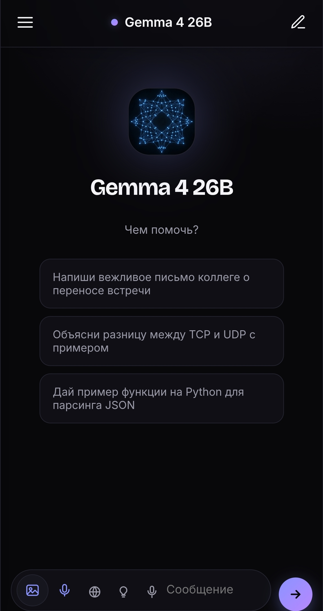
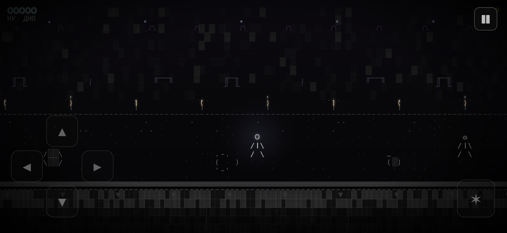

<div align="center">


# Дароу 👋

### Космос • Хак • Игры • ИИ • Ленивость


<br/>

[](https://t.me/smuxo)
[](https://huggingface.co/smuxo)


</div>

<br/>

## ⚡ whoami

```javascript
const smuxo = {
  greeting: "Дароу",

  currentlyBuilding: [
    "Gemmi",       // ИИ в кармане
    "SMUXO",       // ASCII-роглайк
    "Kosmos",      // космос
    "smuxo-Hack"   // мультитул
  ],

  interests: ["AI", "Space", "Games", "Web", "Design"],

  motto: "Код без идеи — очередная хуйня"
};
```

<br/>

## 🛠️ Чо я сделал

### 💎 Gemmi

Собственный ИИ-чат для Android.

Клиент для моделей **Google Gemma** — стриминг ответов, markdown, персоны, картинки, голос и озвучка. Лёгкий, быстрый, без подписок и лишней шелухи.



**Что внутри:**

* 💬 Стриминг ответов в реальном времени
* 🎭 Персоны и пресеты
* 🖼️ Вложения картинок
* 🎙️ Голосовой ввод + озвучка
* 💾 Бэкап и восстановление чатов

<div align="right"><sub>🟢 Активная разработка</sub></div>

---

### ⚔️ SMUXO

ASCII-роглайк в духе Stone Story RPG и Hollow Knight.

Мой основной проект на данный момент. Целый мир из псевдографики.



**Фишки:**

* 🗺️ Ветвящийся мир с картой в стиле Hollow Knight
* 🪞 Парирование через зеркало
* 💀 Боссы с фазами
* 🎨 Своя палитра для каждой локации
* 😴 (я ленивый, делаю долго)

<div align="right"><sub>🟢 Активная разработка</sub></div>

---

### 🌌 Kosmos

Мини Space Engine.

Эксперименты с космосом, планетами и звёздными системами.


**Планируется:**

* 🌠 Норм млечный путь
* 🐛 Фикс уймы багов
* ⭐ Реальные данные звёзд
* 🌀 Генерация галактик

---

### 🧰 smuxo-Hack

Мультитул для мамкиных хакеров.


**Возможности:**

* 📦 HTML → APK
* 🔧 Утилиты
* 🎲 Генераторы
* 🧪 Различные эксперименты

<br/>

## 🏷️ Плашечки 😍

<div align="center">


</div>

<br/>

## 📊 GitHub

<div align="center">


</div>

<br/>

## 🎯 Сейчас пилю

```text
SMUXO
███████████████░░░░ 75%   ⚔️ основной фокус

Gemmi
██████████████░░░░░ 70%   💎 почти готов

Kosmos
██████░░░░░░░░░░░░░ 30%   🌌 когда-нибудь

smuxo-Hack
████████░░░░░░░░░░░ 40%   🧰 по настроению
```

<br/>

## 🌐 Найти меня

<div align="center">

| Где | Что |
|:---:|:---:|
| 🐙 **GitHub** | ты уже нашёл) |
| ✈️ **Telegram** | [t.me/smuxo](https://t.me/smuxo) |
| 🤗 **Hugging Face** | [huggingface.co/smuxo](https://huggingface.co/smuxo) |

</div>

<br/>

<div align="center">

### 🌌 Спасибо, что заглянул

> «Эволюция продолжается, а smuxo её обгоняет.»


</div>
